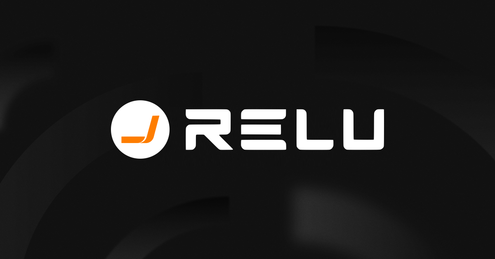

<div align="center">

# Relu

**The complete platform for creating autonomous AI agents that work for you**

Build, manage, and train sophisticated AI agents for any use case. Create powerful agents that act autonomously on your behalf.

[](https://discord.gg/RvFhXUdZ9H)
[](https://x.com/korti)
[](https://github.com/sainabob/relu)
[](https://github.com/sainabob/relu/labels/bug)

<!-- Keep these links. Translations will automatically update with the README. -->
[Deutsch](https://www.readme-i18n.com/sainabob/relu?lang=de) | 
[Español](https://www.readme-i18n.com/sainabob/relu?lang=es) | 
[français](https://www.readme-i18n.com/sainabob/relu?lang=fr) | 
[日本語](https://www.readme-i18n.com/sainabob/relu?lang=ja) | 
[한국어](https://www.readme-i18n.com/sainabob/relu?lang=ko) | 
[Português](https://www.readme-i18n.com/sainabob/relu?lang=pt) | 
[Русский](https://www.readme-i18n.com/sainabob/relu?lang=ru) | 
[中文](https://www.readme-i18n.com/sainabob/relu?lang=zh)


</div>


## 🌟 What Makes Relu Special

### 🤖 Includes Relu Super Worker – Flagship Generalist AI Worker
Meet Relu Super Worker, our showcase agent that demonstrates the full power of the Relu platform. Through natural conversation, Relu Super Worker handles research, data analysis, browser automation, file management, and complex workflows – showing you what's possible when you build with Relu.

### 🔧 Build Custom Relu Super Worker-Type Agents
Create your own specialized agents tailored to specific domains, workflows, or business needs. Whether you need agents for customer service, data processing, content creation, or industry-specific tasks, Relu provides the infrastructure and tools to build, deploy, and scale them.

### 🚀 Complete Platform Capabilities
- **Browser Automation**: Navigate websites, extract data, fill forms, automate web workflows
- **File Management**: Create, edit, and organize documents, spreadsheets, presentations, code
- **Web Intelligence**: Crawling, search capabilities, data extraction and synthesis
- **System Operations**: Command-line execution, system administration, DevOps tasks
- **API Integrations**: Connect with external services and automate cross-platform workflows
- **Agent Builder**: Visual tools to configure, customize, and deploy agents

## 📋 Table of Contents

- [🌟 What Makes Relu Special](#-what-makes-relu-special)
- [🎯 Agent Examples & Use Cases](#-agent-examples--use-cases)
- [🏗️ Platform Architecture](#️-platform-architecture)
- [🚀 Quick Start](#-quick-start)
- [🏠 Self-Hosting](#-self-hosting)
- [🤝 Contributing](#-contributing)
- [📄 License](LICENSE)

## 🎯 Agent Examples & Use Cases

### Relu Super Worker - Your Generalist AI Worker

Relu Super Worker demonstrates the full capabilities of the Relu platform as a versatile AI worker that can:

**🔍 Research & Analysis**
- Conduct comprehensive web research across multiple sources
- Analyze documents, reports, and datasets
- Synthesize information and create detailed summaries
- Market research and competitive intelligence

**🌐 Browser Automation**
- Navigate complex websites and web applications
- Extract data from multiple pages automatically
- Fill forms and submit information
- Automate repetitive web-based workflows

**📁 File & Document Management**
- Create and edit documents, spreadsheets, presentations
- Organize and structure file systems
- Convert between different file formats
- Generate reports and documentation

**📊 Data Processing & Analysis**
- Clean and transform datasets from various sources
- Perform statistical analysis and create visualizations
- Monitor KPIs and generate insights
- Integrate data from multiple APIs and databases

**⚙️ System Administration**
- Execute command-line operations safely
- Manage system configurations and deployments
- Automate DevOps workflows
- Monitor system health and performance

### Build Your Own Specialized Agents

The Relu platform enables you to create agents tailored to specific needs:

**🎧 Customer Service Agents**
- Handle support tickets and FAQ responses
- Manage user onboarding and training
- Escalate complex issues to human agents
- Track customer satisfaction and feedback

**✍️ Content Creation Agents**
- Generate marketing copy and social media posts
- Create technical documentation and tutorials
- Develop educational content and training materials
- Maintain content calendars and publishing schedules

**📈 Sales & Marketing Agents**
- Qualify leads and manage CRM systems
- Schedule meetings and follow up with prospects
- Create personalized outreach campaigns
- Generate sales reports and forecasts

**🔬 Research & Development Agents**
- Conduct academic and scientific research
- Monitor industry trends and innovations
- Analyze patents and competitive landscapes
- Generate research reports and recommendations

**🏭 Industry-Specific Agents**
- Healthcare: Patient data analysis, appointment scheduling
- Finance: Risk assessment, compliance monitoring
- Legal: Document review, case research
- Education: Curriculum development, student assessment

Each agent can be configured with custom tools, workflows, knowledge bases, and integrations specific to your requirements.

## 🏗️ Platform Architecture


Relu consists of four main components that work together to provide a complete AI agent development platform:

### 🔧 Backend API
Python/FastAPI service that powers the agent platform with REST endpoints, thread management, agent orchestration, and LLM integration with Anthropic, OpenAI, and others via LiteLLM. Includes agent builder tools, workflow management, and extensible tool system.

### 🖥️ Frontend Dashboard
Next.js/React application providing a comprehensive agent management interface with chat interfaces, agent configuration dashboards, workflow builders, monitoring tools, and deployment controls.

### 🐳 Agent Runtime
Isolated Docker execution environments for each agent instance featuring browser automation, code interpreter, file system access, tool integration, security sandboxing, and scalable agent deployment.

### 🗄️ Database & Storage
Supabase-powered data layer handling authentication, user management, agent configurations, conversation history, file storage, workflow state, analytics, and real-time subscriptions for live agent monitoring.

## 🚀 Quick Start

Get your Relu platform running in minutes with our automated setup wizard:

### 1️⃣ Clone the Repository
```bash
git clone https://github.com/sainabob/relu.git
cd relu
```

### 2️⃣ Run the Setup Wizard
```bash
python setup.py
```
The wizard will guide you through 14 steps with progress saving, so you can resume if interrupted.

**💡 Automatic Startup:** At the end of setup, you can choose to automatically start Kortix Super Worker. The setup wizard supports both:
- **Docker mode**: Automatically starts all services via Docker Compose
- **Manual mode**: Automatically starts services using `start.py` helper script

If you choose automatic startup, your platform will be running immediately after setup completes!

### 3️⃣ Start the Platform (if not started automatically)
```bash
python start.py
```

That's it! Your Relu platform will be running with Relu Super Worker ready to assist you.

## 🏠 Self-Hosting

Just use "setup.py". Ty mate.


---

<div align="center">

**Ready to build your first AI agent?** 

[Get Started](./docs/SELF-HOSTING.md) • [Join Discord](https://discord.gg/RvFhXUdZ9H) • [Follow on Twitter](https://x.com/relu)

</div>


## Docker
 ```bash
 cd backend && docker build -t relu-backend:latest .

 cd frontend && docker build -t relu-frontend:latest .

 cd .. && docker compose up -d

 ```